As a final capstone project, Alegorithm was developed centered around two beer-related concepts: to establish similarities between commercial beers in order to provide recommendations for consumers and to create a Generative model which could create new beer recipes for brewers on the fly. For the commercial beer section data was scraped from some popular beer-related websites, cleaned, unsupervised clustering models were created, an API was written for those asynchronous requests, the dimensionality of the results was reduced and plotted with Dash, then all hosted on a website for a user to explore.

For the generative section the data was scraped from multiple home brewer websites, a data format for a ‘beer recipe’ was standardized, a RNN using Keras was trained to predict a home brew’s user rating, then existing recipes were manipulated iteratively to create entirely new recipes which would be rated with our model. The results only retained the recipes which ranked highly, and these new recipes were offered up to users with another interactive Dash visualization on the website.

<h3>A walkthrough </h3>

The website has been taken down since the completion of the MIDS program, however you can get a feel for the functionality of the app below 

  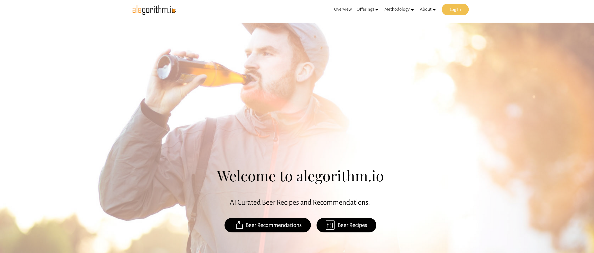

  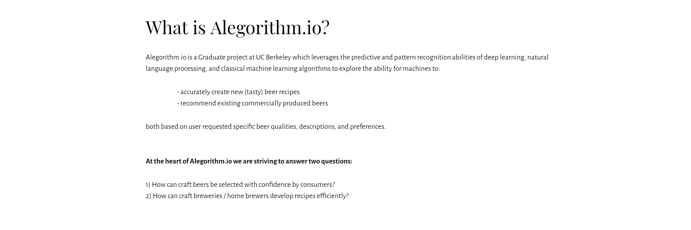

  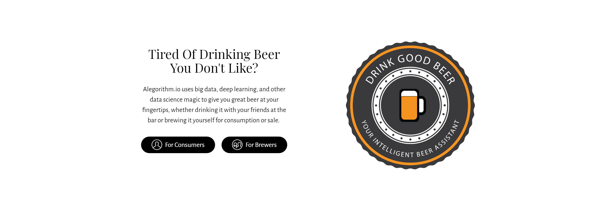

  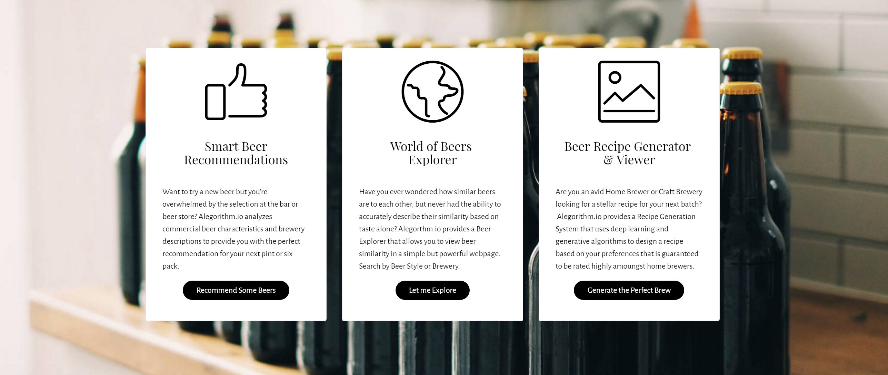

  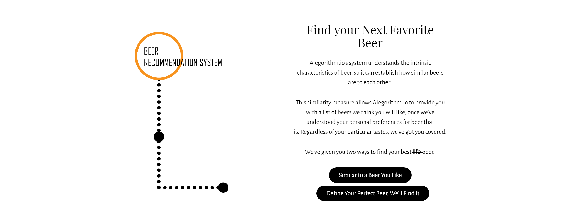

  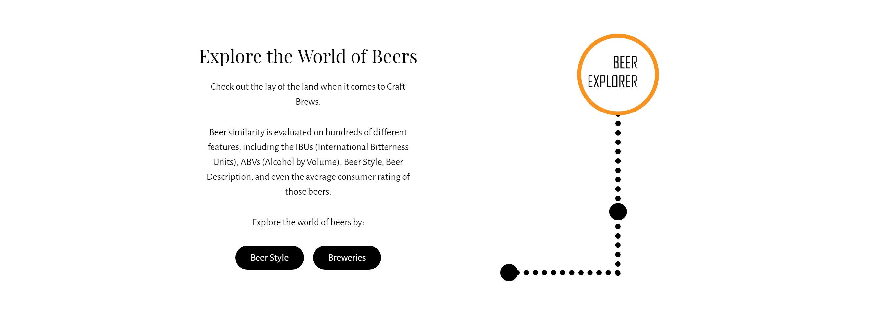

  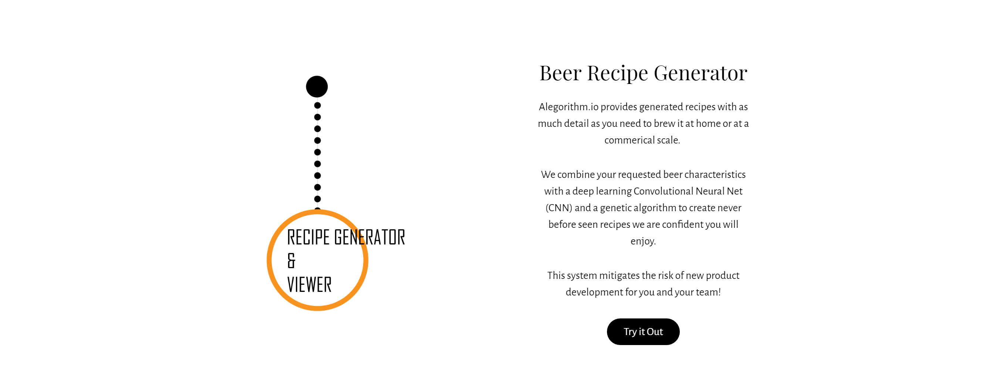

  

<h3>A few details on the technical implementation </h3>

  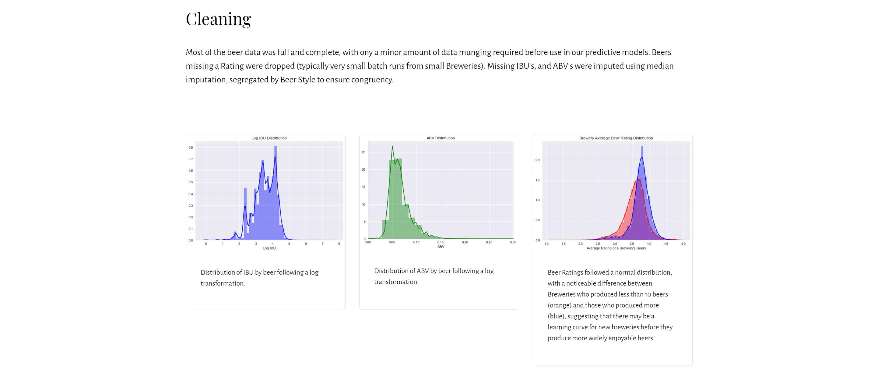

  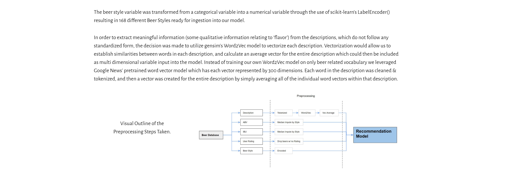

  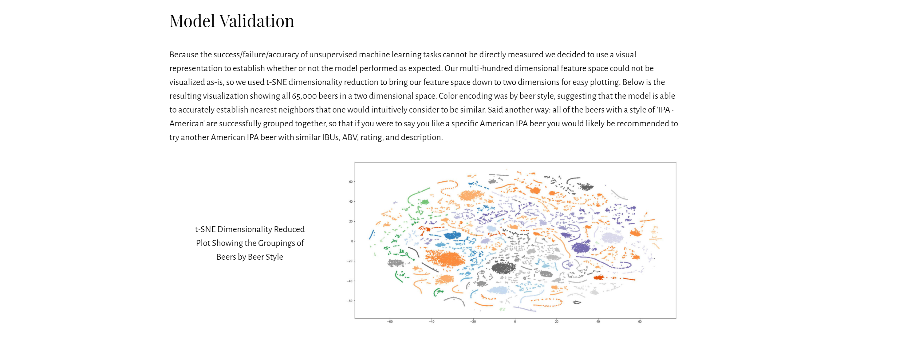

  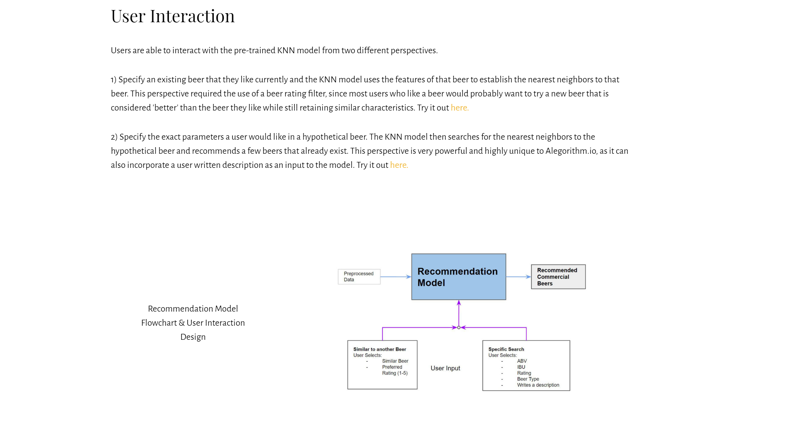

