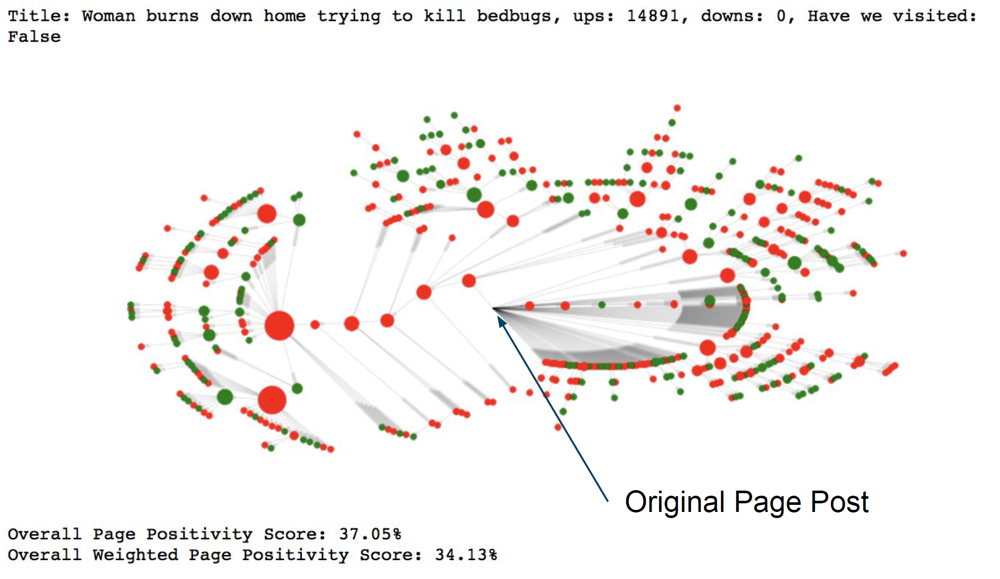

As a conclusion to the 'w266 - Natural Language Processing with Deep Learning' course, this project explored the creation of a model to predict sentiment within social media posts (specifically Reddit) and investigated the impact of positive/negative posts to the overall sentiment of a single discussion thread. 
Using Keras a simple MLP (multi-layer perceptron) neural network was trained on the Sentiment 140 corpora, a dataset with 1.6 million sentiment-labeled tweets. New posts were then ingested from a single Reddit page and the trained sentiment model was used to establish the overall positivity/negativity score for that page. Investigating how negative or positive comments might breed additional positive or negative comments within the thread, the network of posts were then visualized with sentiment encoded as color to help spot interesting trends in how discussions unfolded on these social networking site. 

  

<h3> Read the paper or the summary presentation below for more detail </h3>

    <iframe src="https://drive.google.com/file/d/1ufOTtPare4oxyl2wS8FTjToKSZvReViY/preview" width="100%" height="480"></iframe>

    <iframe src="https://drive.google.com/file/d/1HVQHS90oo-vqv48mYGr_2dSTJk8ptW9W/preview" width="100%" height="480"></iframe>

