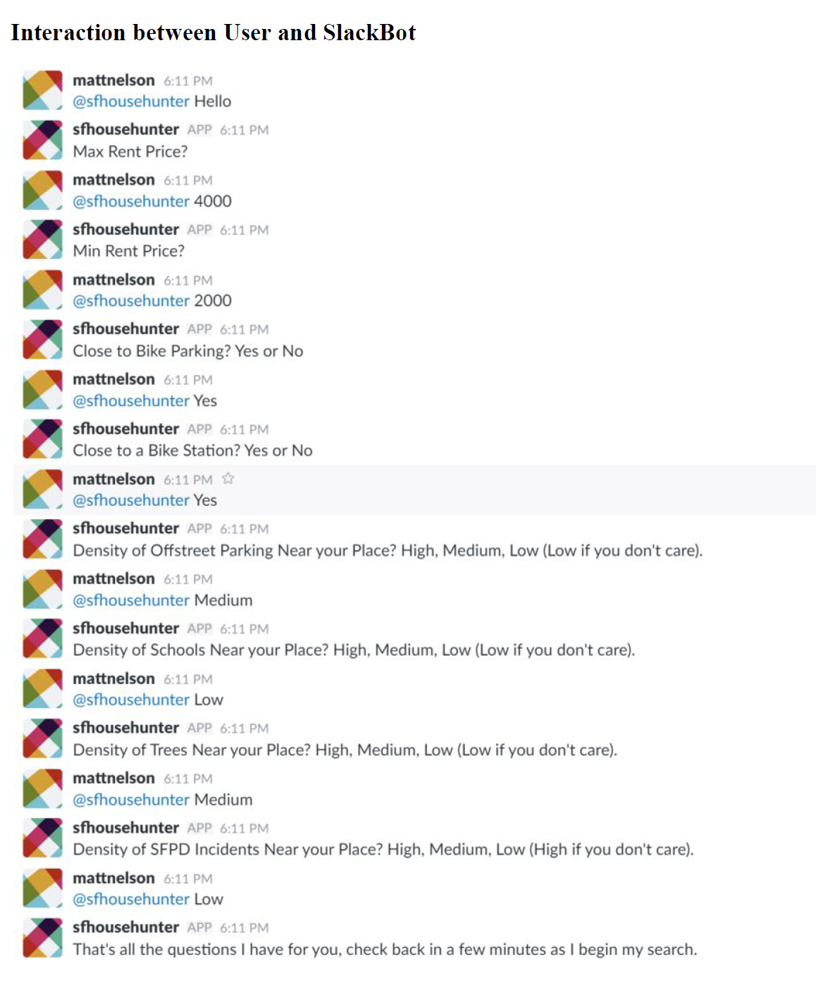
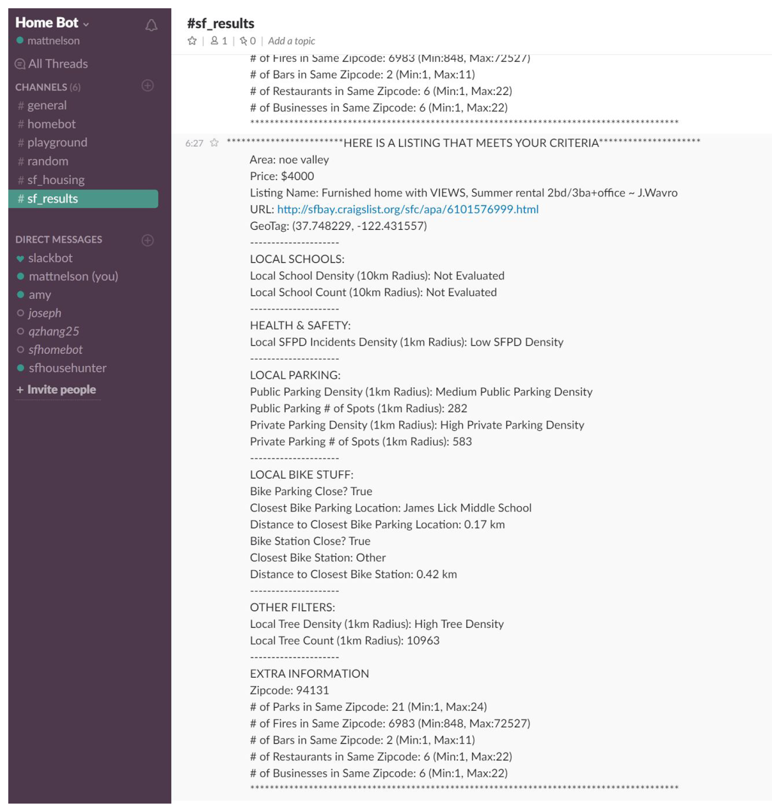

As a final project for the 'w205 - Storing and Retrieving Data' course, our group chose to work with a Craigslist API to query current house rentals in the San Francisco area. 

Our Bot was designed to ask a user a series of descriptive questions within a single Slack channel in order to establish personal preferences for the type of rental they wanted (close to parks, close to transit, bike parking available, high density of bars, etc.). The underlying Python & Spark code would ask the Craigslist API for a valid subset of the available rentals, then evaluate each rental against multiple static datasets (locations of public transit hubs, lat/long of treed areas in San Fran, bike parking locations, etc) to determine a shortlist of rentals that meet the users criteria. 

This bot was surprisingly quite adept, and because it utilized Spark it could hold all the data in memory on our cluster resulting in reasonably quick queries. 

<h3> Interaction Example & Results </h3>

  

  

<h3> Full Presentation </h3>

  <iframe src="https://drive.google.com/file/d/1BXcRNDoWWD4tSiyaMlnrLxXpu4pzfP4N/preview" width="100%" height="480"></iframe>

