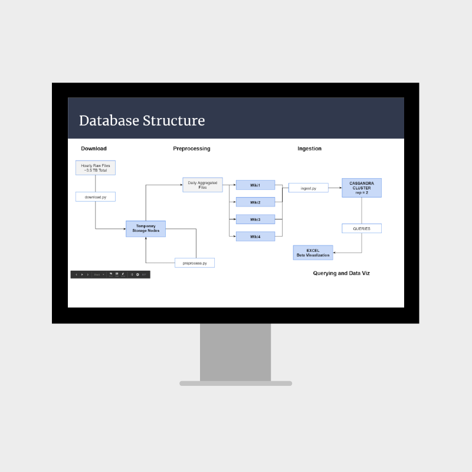

The final project within the 'w251 - Scaling Up! Really Big Data' course leveraged a large dataset from Wikipedia. This dataset included 2 1/2 years worth of hourly Wikipedia Page View Data and was roughly 3.5TB in size. Working with 33 billion rows of data required tools more capable than Excel, leading to the selection of a popular NoSQL document-store style database called Cassandra as the data store. The project’s main goals were simply to clean & prepare the data for storage in Cassandra by aggregating all page views by day, then to utilize Apache Spark to Query the database and find some interesting stories in the data. While the goals were modest, the size and scale of the dataset provided challenges in establishing reasonable query runtimes.

  

